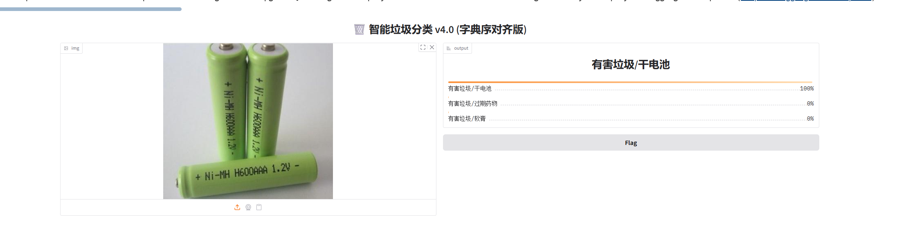

# 🗑️ 基于 ResNet18 的 40 类生活垃圾识别系统

[](https://www.python.org/)
[](https://pytorch.org/)

## 🌟 项目亮点
* **高精度识别**：通过数据增强（Data Augmentation）和学习率调度，在 40 类生活垃圾数据集上达到 **76.3%** 的 Top-1 准确率。
* **工程化落地**：基于 **Gradio** 构建了 Web 交互界面，支持图片上传与实时推断。
* **Bug 攻坚**：解决了深度学习推理中常见的 **字典序标签偏移 (Label Mismatch)** 问题。

## 🛠️ 技术栈
* **模型架构**: ResNet18 (迁移学习)
* **深度学习框架**: PyTorch
* **交互界面**: Gradio
* **硬件加速**: NVIDIA GeForce RTX 4060 (CUDA 加速)

## 📊 识别类别 (40类)
| 分类 | 包含项目 (部分展示) |
| :--- | :--- |
| **可回收物** | 易拉罐、纸板箱、饮料瓶、旧衣服、塑料玩具等 |
| **厨余垃圾** | 剩饭剩菜、水果果皮、蛋壳、鱼骨等 |
| **有害垃圾** | 干电池、过期药物、软膏等 |
| **其他垃圾** | 一次性快餐盒、烟蒂、牙签、竹筷等 |

## 🚀 快速开始

### 1. 环境准备
```bash
pip install torch torchvision gradio pillow

