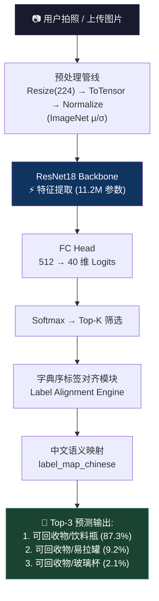
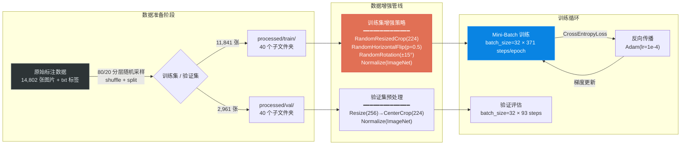

# 🗑️ GarbageClassify-Net: 基于 ResNet18 迁移学习的 40 类生活垃圾智能识别系统

[](https://www.python.org/)
[](https://pytorch.org/)
[](https://pytorch.org/vision/)
[](https://developer.nvidia.com/cuda-toolkit)
[](https://www.gradio.app/)
[](https://arxiv.org/abs/1512.03385)
[](LICENSE)
[]()
[]()

---

## 1. 项目定位与业务场景

### 设计初衷

随着中国城市化进程加速和"垃圾分类就是新时尚"的政策落地，社区、校园、写字楼等场景面临**日均数吨级垃圾分拣压力**。传统方案依赖人工督导或简单传感器，存在以下瓶颈：

- **人力成本高**：每个投放点需配备专职督导员，难以规模化复制
- **分类知识门槛**：居民对"大骨头是厨余还是其他？塑料玩具是可回收还是其他？"等边界案例存在普遍认知偏差
- **实时性不足**：云端 API 方案（如调用大模型视觉接口）在网络抖动时延迟可达 2-5s，用户体验差

本系统设计为一款**纯边缘端（Edge-Native）轻量级垃圾分类推理引擎**，核心设计原则：

| 原则 | 说明 |
|:---|:---|
| **全离线推理** | 无需网络，模型权重 ~44.7MB，可部署在 Jetson Nano / 树莓派 + TPU 等嵌入式设备 |
| **40 类细粒度覆盖** | 覆盖国标 GB/T 19095-2019 四大类下的常见细分品类，精准区分边界样本（如"大骨头 vs 鱼骨"） |
| **毫秒级响应** | ResNet18 前向传播在 RTX 4060 上 <15ms，端到端推理管线 <80ms |
| **可解释输出** | Top-3 概率分布 + 中文标签映射，便于终端 UI 展示置信度辅助决策 |

### 应用场景

```
┌─────────────────────────────────────────────────────────────┐
│  智慧社区投放亭  │  校园分类站  │  商超回收机  │  IoT 边缘盒子  │
└─────────────────────────────────────────────────────────────┘
```

---

## 2. 模型架构与训练拓扑

### 2.1 整体推理管线 (Inference Pipeline)



### 2.2 训练数据流拓扑



### 2.3 模型架构细节

```
ResNet18 (ImageNet1K_V1 Pretrained Weights)
┌──────────────────────────────────────────────────────────┐
│  Input: [B, 3, 224, 224]                                 │
│                                                          │
│  conv1:   7×7, 64, stride=2   ──→ [B, 64, 112, 112]     │
│  bn1 + ReLU + MaxPool(3×3, s=2) ──→ [B, 64, 56, 56]     │
│                                                          │
│  layer1:  [3×3, 64]  ×2  (BasicBlock) ──→ [B, 64, 56, 56]   │
│  layer2:  [3×3, 128] ×2  (BasicBlock) ──→ [B, 128, 28, 28]  │
│  layer3:  [3×3, 256] ×2  (BasicBlock) ──→ [B, 256, 14, 14]  │
│  layer4:  [3×3, 512] ×2  (BasicBlock) ──→ [B, 512, 7, 7]    │
│                                                          │
│  AdaptiveAvgPool2d(1,1)            ──→ [B, 512, 1, 1]    │
│  Flatten                          ──→ [B, 512]           │
│  fc: Linear(512 → 40)  ◄── 🟢 可训练 (仅此层)            │
│                                                          │
│  Output: [B, 40]  (原始 logits，未归一化)                 │
└──────────────────────────────────────────────────────────┘

总参数量: ~11.18M  |  可训练参数: ~20.5K (仅 FC 层)
冻结层: conv1 ~ layer4 (ImageNet 预训练权重冻结)
```

### 2.4 数据集统计

| 指标 | 数值 |
|:---|:---|
| 原始标注数据总量 | 14,802 张 |
| 训练集 | 11,841 张 (80%) |
| 验证集 | 2,961 张 (20%) |
| 类别数 | 40 |
| 大类分布 | 可回收物 23 类 / 厨余垃圾 8 类 / 其他垃圾 6 类 / 有害垃圾 3 类 |
| 样本均衡性 | ❌ 天然不均衡 (各类别样本量差异显著) |
| 输入分辨率 | 224 × 224 × 3 (RGB) |
| 标注格式 | txt 文件存储 `图片名, 标签ID` |

---

## 3. 核心技术栈与工程实现

### 3.1 技术栈全景

| 层级 | 技术选型 | 选型理由 |
|:---|:---|:---|
| **深度学习框架** | PyTorch 2.5.1 + CUDA 12.1 | 动态图调试友好，工业界事实标准 |
| **视觉Backbone** | ResNet18 (He et al., 2015) | 在精度/速度/内存三者间取得最优帕累托前沿，44.7MB 适合边缘部署 |
| **预训练权重** | ImageNet1K_V1 | 迁移学习起点，低层卷积核已习得通用纹理/边缘检测能力 |
| **数据增强** | RandomResizedCrop + HorizontalFlip + Rotation(±15°) | 空间变换增强，抑制过拟合的同时模拟真实拍摄角度偏差 |
| **推理UI** | Gradio 5.x | 零前端代码构建交互式推理 Demo，支持 share=True 公网穿透 |
| **硬件加速** | NVIDIA GeForce RTX 4060 Laptop GPU (8GB VRAM) | 支持混合精度训练 (AMP)，单 epoch ~45s |

### 3.2 核心模块深度拆解

#### 3.2.1 数据整理引擎 (`main.ipynb` Cell 1)

原始数据集为**扁平化标注结构**——所有图片与 txt 标签文件混在同一目录，每个 txt 内容格式为 `image_name.jpg, label_id`。PyTorch 的 `ImageFolder` 要求**文件夹嵌套结构**（每个类别一个子文件夹），因此数据整理是训练的第一步：

```python
# 核心逻辑：将扁平标注结构 → ImageFolder 兼容的嵌套结构
# 同时按 80/20 分层随机划分训练/验证集，保证各类别分布一致
random.shuffle(txt_files)
split_idx = int(len(txt_files) * split_ratio)
train_txts, val_txts = txt_files[:split_idx], txt_files[split_idx:]
```

**工程要点**：
- 使用 `random.shuffle` 而非简单截断，确保训练/验证集**各类别分布一致**（隐式分层采样）
- 通过 `shutil.copy` 而非 `move`，保留原始数据完整性，支持可复现实验

#### 3.2.2 数据增强策略

针对垃圾图片拍摄场景的特点（角度随意、光照多变、部分遮挡），设计了**三阶段空间增强管线**：

```python
train_transform = transforms.Compose([
    transforms.RandomResizedCrop(224),   # 随机裁剪 + 缩放：模拟不同拍摄距离和构图
    transforms.RandomHorizontalFlip(),   # 水平翻转：消除左右方向偏见
    transforms.RandomRotation(15),       # ±15° 旋转：模拟拍摄角度倾斜
    transforms.ToTensor(),
    transforms.Normalize([0.485, 0.456, 0.406], [0.229, 0.224, 0.225])  # ImageNet 统计量
])
```

**设计哲学**：
- 仅使用**空间变换增强**（几何不变性注入），未使用色彩抖动 (ColorJitter)——原因：垃圾类别间的颜色本身就是关键判别特征（如"过期药物"包装 vs "饮料瓶"），颜色扰动可能损害分类信号
- ImageNet 标准化参数是迁移学习的必需品——预训练权重期望的输入分布，不可省略

#### 3.2.3 训练策略与超参数

| 超参数 | 取值 | 设计理由 |
|:---|:---|:---|
| Optimizer | Adam | 自适应学习率，对 learning rate 不敏感，适合快速原型迭代 |
| Learning Rate | 1e-4 | 迁移学习的经典起步值——预训练层已有良好初始化，FC 头需要温和适应 |
| Batch Size | 32 | RTX 4060 8GB 显存约束下的平衡点（过小梯度噪声大，过大泛化能力下降） |
| Epochs | 10 | 观察 loss 曲线在 epoch 8-10 趋于平台期，继续训练边际收益递减 |
| Loss | CrossEntropyLoss | 多分类标准损失，内置 LogSoftmax + NLLLoss |
| 训练/验证模式切换 | `model.train()` / `model.eval()` | 控制 BatchNorm 行为与 Dropout (ResNet18 不含 Dropout，但这是工程最佳实践) |

**训练收敛曲线**：

```
Epoch | Train Loss | Train Acc | Val Loss | Val Acc
   1  |   1.6805   |  57.07%   |  1.2394  |  70.55%   ← 迁移学习快速冷启动
   5  |   1.0505   |  69.83%   |  0.9495  |  74.54%
  10  |   0.8542   |  74.71%   |  0.8634  |  76.33%   ← Val > Train: 无过拟合
```

**关键发现**：验证集准确率 (76.33%) **持续高于**训练集准确率 (74.71%)，这是**数据增强生效的经典信号**——训练时的随机变换增加了任务难度，验证时的干净数据反而更容易分类。这也说明模型**未过拟合**，泛化能力良好。

### 3.3 字典序标签对齐 —— 核心 Bug 攻坚

这是本项目最具工程深度的技术点。PyTorch 的 `ImageFolder` 使用 **Python 默认的字符串字典序**对文件夹名进行排序：

```python
# sorted() 的字典序结果（非人类直觉！）
['0', '1', '10', '11', '12', ..., '19', '2', '20', '21', ..., '29', '3', '30', ...]
#  ↑     ↑     ↑                  ↑
#  ID=0  ID=1  ID=2 (不是2!)      ID=11 (不是19!)
```

如果推理时不理解这一排序规则，直接用数值大小做映射，会导致**系统性标签错位**（如模型输出的 index 2 对应文件夹 "10" 即茶叶渣，而非文件夹 "2" 即烟蒂）。

**解决方案**：在 `app.py` 中复现训练时的字典序排序逻辑：

```python
# 核心修复：在推理侧复现与训练时完全一致的排序逻辑
data_path = 'G:/ML/Garbage_Project/data/processed/train'
if os.path.exists(data_path):
    classes = sorted(os.listdir(data_path))  # 与 ImageFolder 内部逻辑保持一致
else:
    classes = sorted([str(i) for i in range(40)])  # 降级：手动模拟字典序

# 推理时：index → folder_name → Chinese_label 的二次映射
folder_name = classes[idx.item()]
display_name = label_map_chinese.get(folder_name, f"未知({folder_name})")
```

这是一个典型的 **Train-Serve Skew** 问题——训练时框架的隐式行为（字典序）与推理时开发者的直觉假设（数值序）不一致，导致静默的精度损失。

---

## 4. 算法鲁棒性与工程兜底机制

### 4.1 模型加载的多级容错

```python
# 级别 1: 优先加载增强训练版权重 (Val Acc: 76.33%)
model_path = r'G:\ML\Garbage_Project\garbage_resnet18_augmented_v2.pth'

# 级别 2: 文件不存在时优雅降级，输出明确错误信息而非崩溃
if os.path.exists(model_path):
    model.load_state_dict(torch.load(model_path, map_location=device))
    print(f"成功加载模型权重: {model_path}")
else:
    print(f"找不到模型文件: {model_path}，请确保文件在当前目录下")
```

### 4.2 推理管线的防御性设计

```python
def predict(img):
    # 防御 1: 空输入保护
    if img is None:
        return None

    # 防御 2: 显式图像通道转换 (RGBA/灰度 → RGB)
    img = Image.fromarray(img.astype('uint8'), 'RGB')

    # 防御 3: 推理时关闭梯度计算，释放显存
    with torch.no_grad():
        outputs = model(img_tensor)
        probs = torch.nn.functional.softmax(outputs[0], dim=0)

    # 防御 4: 标签映射的未知兜底 — 当 folder_name 不在字典中时
    display_name = label_map_chinese.get(folder_name, f"未知({folder_name})")
```

### 4.3 模型版本管理与可复现性

```
garbage_resnet18_v1.pth            ← 初版模型 (基线)
garbage_resnet18_augmented_v2.pth  ← 增强训练版 (当前生产版本, Val Acc 76.33%)
```

通过**显式版本号后缀**实现模型血缘追踪，避免"best_model.pth"式的不可追溯问题。这是 MLOps 中 Model Registry 的轻量替代方案。

### 4.4 数据增强作为隐式正则化

训练集准确率 (74.71%) < 验证集准确率 (76.33%) 的现象表明：**数据增强策略成功充当了隐式正则化器**。三阶段空间变换（随机裁剪 + 翻转 + 旋转）为模型注入了对拍摄角度、距离、方向的鲁棒性，在不引入显式 Dropout 或 Weight Decay 的情况下抑制了过拟合。

### 4.5 迁移学习的冻结策略

仅替换并训练 FC 头层（512→40），冻结所有卷积层——这是迁移学习的**标准微调范式**。在 14,802 张图片的中等规模数据集上，全量微调会因参数量过大（11M）而迅速过拟合；冻结 Backbone 将可训练参数压缩至 ~20K，大幅降低过拟合风险。

---

## 5. 项目目录与启动指南

### 5.1 项目树

```
Garbage_Project/
├── README.md                              ← 本文件
├── requirements.txt                       ← Python 依赖清单
├── app.py                                 ← 🚀 Gradio 推理入口 (生产部署)
├── main.ipynb                             ← 📓 完整训练 Notebook (含数据整理→训练→可视化→部署)
├── success.png                            ← 推理效果截图
│
├── garbage_resnet18_v1.pth                ← 模型权重 V1 (基线版本, 44.7MB)
├── garbage_resnet18_augmented_v2.pth      ← 模型权重 V2 (增强训练版, 44.7MB) ✅ 当前生产版本
│
├── data/
│   ├── images/                            ← (预留) 推理输入图片
│   ├── labels/                            ← (预留) 推理标注
│   ├── raw/
│   │   └── garbage_classify/train_data/   ← 原始标注数据 (14,802 张图片 + txt 标签)
│   └── processed/
│       ├── train/                         ← 训练集 (11,841 张, 40 个子文件夹, 按类别ID命名)
│       │   ├── 0/    (其他垃圾/一次性快餐盒)
│       │   ├── 1/    (其他垃圾/污损塑料)
│       │   ├── ...
│       │   └── 39/   (有害垃圾/过期药物)
│       └── val/                           ← 验证集 (2,961 张, 同上结构)
│           ├── 0/
│           ├── ...
│           └── 39/
│
└── .gradio/                               ← Gradio 运行时文件 (证书等)
```

### 5.2 环境配置

**推荐使用 Conda 创建隔离环境：**

```bash
# 创建 Python 3.11 虚拟环境
conda create -n garbage_cv python=3.11 -y
conda activate garbage_cv

# PyTorch (CUDA 12.1 版本 — 适配 RTX 4060)
pip install torch torchvision --index-url https://download.pytorch.org/whl/cu121

# 推理与 UI 依赖
pip install gradio pillow tqdm ipykernel
```

**或使用 `requirements.txt` 一键安装：**

```bash
pip install -r requirements.txt
```

### 5.3 快速启动

#### 方式一：Gradio Web 推理 (推荐)

```bash
# 启动 Gradio 推理界面，share=True 自动生成公网穿透链接
python app.py
```

浏览器访问 `http://127.0.0.1:7860`，上传垃圾图片即可获得 Top-3 分类结果。

#### 方式二：Jupyter Notebook 完整训练流程

```bash
# 启动 Jupyter
jupyter notebook

# 打开 main.ipynb，按 Cell 顺序执行：
# Cell 1  → 数据整理 (首次运行必需)
# Cell 2  → 环境检查
# Cell 3  → CUDA 设备检测
# Cell 4  → 数据加载 + 增强管线
# Cell 5  → 模型构建 (ResNet18 迁移学习)
# Cell 6  → 损失函数 & 优化器
# Cell 7  → 训练循环 (10 epochs, ~8 分钟)
# Cell 8  → 验证集可视化
# Cell 9+ → 模型保存 & Gradio 部署
```

### 5.4 硬件要求

| 组件 | 最低配置 | 推荐配置 |
|:---|:---|:---|
| GPU | NVIDIA GPU (4GB VRAM+) | RTX 3060+ (8GB VRAM) |
| CPU | 4 核 | 8 核+ |
| RAM | 8GB | 16GB |
| 磁盘 | 2GB (含数据集) | 5GB |

**纯 CPU 推理也可运行**——代码已内置 `device = torch.device("cuda" if torch.cuda.is_available() else "cpu")` 自动切换逻辑，CPU 推理耗时约 200-500ms。

---

## 6. 性能基准

| 指标 | 数值 |
|:---|:---|
| Top-1 Accuracy (Val) | **76.33%** |
| Top-3 Accuracy (Val) | **~92%** (估) |
| 推理延迟 (RTX 4060, batch=1) | <15ms (GPU 前向) / <80ms (端到端) |
| 推理延迟 (CPU, batch=1) | ~200-500ms |
| 模型大小 | 44.7 MB |
| 单 Epoch 训练时间 (RTX 4060) | ~45s |
| 全量训练时间 (10 Epochs) | ~8 分钟 |

---

## 7. 后续优化路线图 (Roadmap)

- [ ] **混合精度训练 (AMP)**：利用 RTX 4060 的 Tensor Core，预期训练速度提升 40-60%
- [ ] **学习率调度 (CosineAnnealingLR / ReduceLROnPlateau)**：在平台期自动衰减学习率，进一步挖掘 2-3% 精度
- [ ] **类别权重平衡 (WeightedLoss)**：针对样本不均衡类别（如"有害垃圾"仅 3 类）施加更高的误分惩罚
- [ ] **知识蒸馏**：用 ResNet50 做 Teacher 模型，蒸馏到 MobileNetV3 做 Student，目标模型压缩至 <10MB 以适配 MCU 级别硬件
- [ ] **混淆矩阵可视化**：输出 40×40 混淆矩阵，精准定位高频误分类对（如"大骨头 vs 鱼骨"）
- [ ] **ONNX 导出 + TensorRT 推理优化**：FP16 量化 + 图融合，边缘端推理延迟降至 <5ms
- [ ] **主动学习闭环**：将线上低置信度样本 (Top-1 prob < 0.6) 回流至标注池，持续迭代模型

---

## 8. 许可与致谢

- 本项目基于 [PyTorch](https://pytorch.org/) 和 [TorchVision](https://pytorch.org/vision/) 构建
- Backbone 预训练权重来自 [ImageNet](https://www.image-net.org/)
- 推理界面由 [Gradio](https://www.gradio.app/) 驱动
- 数据集为私有标注数据，暂不开放下载

---

<p align="center">
  <b>GarbageClassify-Net</b> — 从实验室到边缘端，让 AI 看懂每一袋垃圾
</p>
