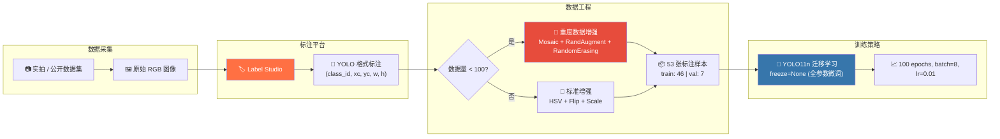
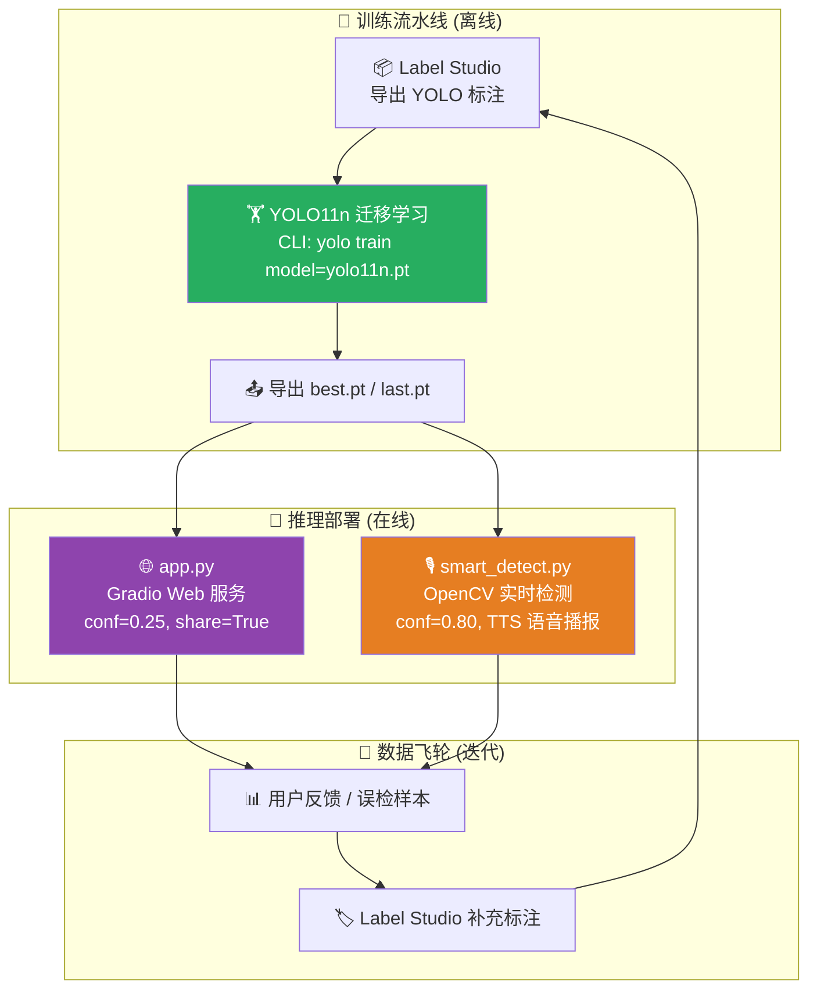
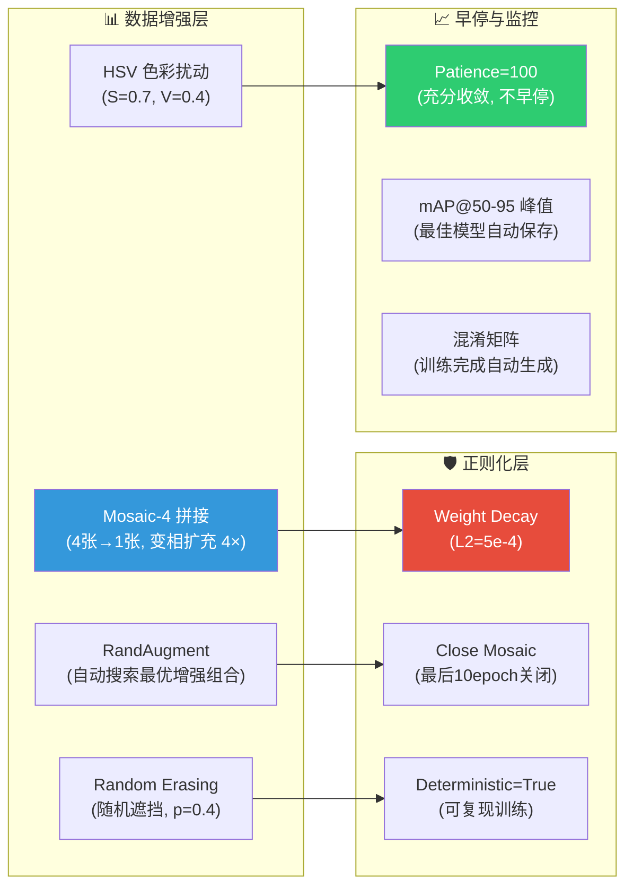

# ♻️ Garbage-YOLO: 基于 YOLO11 的端到端智能垃圾分类检测系统

<div align="center">

[](https://python.org)
[](https://pytorch.org)
[](https://docs.ultralytics.com)
[](https://opencv.org)
[](https://gradio.app)
[](https://developer.nvidia.com/cuda-toolkit)
[](https://labelstud.io)
[](LICENSE)

</div>

---

## 📋 目录

1. [项目定位与业务场景](#1-项目定位与业务场景)
2. [模型架构与训练拓扑](#2-模型架构与训练拓扑)
3. [核心技术栈与工程实现](#3-核心技术栈与工程实现)
4. [算法鲁棒性与工程兜底机制](#4-算法鲁棒性与工程兜底机制)
5. [训练指标与模型评估](#5-训练指标与模型评估)
6. [项目目录与启动指南](#6-项目目录与启动指南)

---

## 1. 项目定位与业务场景

### 🎯 业务痛点

随着全球电子废弃物年增长率突破 3%-5%，**充电宝（移动电源）** 作为含锂离子电池的高危废弃物，其错误投放可能导致垃圾处理厂的粉碎工序引发热失控火灾。传统基于光电传感器的垃圾分选线难以将充电宝从普通塑料/金属流中精准分离 —— 充电宝外观形态变异度极高（柱状、片状、异形共享充电宝），纯规则方法无法覆盖其长尾分布。

### 🧠 解决方案定位

**Garbage-YOLO** 构建了一条从 **数据标注 → 迁移学习 → 实时推理 → 多端部署** 的完整闭环，核心定位是：

> **以极小的标注成本（53 张样本），利用 YOLO11 的预训练视觉先验，实现对 "充电宝" 单一类别的工业级目标检测。**

这是一个典型的 **少样本目标检测 (Few-Shot Object Detection, FSOD)** 落地范式 —— 面向特定品类而非追求 COCO 全类目 mAP，使得一条实际产线仅需 50-100 张产线现场图像即可完成模型冷启动。

### 📦 应用场景矩阵

| 场景 | 部署形态 | 推理延迟要求 | 本项目对应组件 |
|------|----------|-------------|---------------|
| 垃圾投放亭智能督导 | Gradio Web + IP Camera | < 500ms | `app.py` |
| 分选传送带实时预警 | OpenCV + 语音播报 | < 100ms | `smart_detect.py` |
| 边缘端离线推理 | ONNX / TensorRT 导出 | < 50ms | YOLO11 export |
| 数据飞轮回流 | Label Studio + 主动学习 | 离线 | `project/` 标注管线 |

---

## 2. 模型架构与训练拓扑

### 2.1 Backbone 选型: YOLO11n

选用 Ultralytics **YOLO11n (nano)** 作为基座模型:

| 参数 | 值 | 设计理由 |
|------|-----|---------|
| 参数量 | ~2.6M | 极小占用，适配 Jetson Nano / 树莓派等边缘设备 |
| 预训练权重 | `yolo11n.pt` (COCO 80类) | 迁移视觉先验，无需从随机初始化开始 |
| 输入分辨率 | 640×640 | 平衡细粒度特征与推理速度的甜点区间 |
| Anchor-Free 解耦头 | YOLO11 原生 | 免除 Anchor 超参调优，对异形目标更鲁棒 |
| C2f 跨阶段局部网络 | 替换 C3 模块 | 更丰富的梯度流，轻量化同时保持特征表达力 |

### 2.2 数据工程管线: 端到端标注 → 训练



### 2.3 数据集统计

| 指标 | 数值 |
|------|------|
| 类别数量 | 1 (`charging treasure`) |
| 训练集图像 | 46 张 |
| 验证集图像 | 7 张 |
| 标注格式 | YOLO (归一化中心点 + 宽高) |
| 图像来源 | 实拍 + 公开数据混合 |
| 标注工具 | Label Studio (v1.0, 2026) |
| 类别不平衡处理 | 单类别任务，不存在类间不平衡；采用 Mosaic + RandAugment 缓解类内多样性不足 |

### 2.4 训练超参全景

```yaml
# ===== 核心超参 (来自 models/garbage_v2/args.yaml) =====
model:       yolo11n.pt          # 基座权重
epochs:      100                 # 充分收敛 (小数据集需更多 epoch)
batch:       8                   # RTX 4060 8GB 满载
imgsz:       640                 # 标准输入尺寸
device:      cuda:0              # GPU 加速

# ===== 优化器 =====
optimizer:   auto                # AdamW (YOLO11 默认)
lr0:         0.01                # 初始学习率
lrf:         0.01                # 最终学习率因子 (cosine 退火)
momentum:    0.937               # 一阶动量
weight_decay: 0.0005            # L2 正则化 (抑制小数据过拟合)
warmup_epochs: 3.0              # 线性预热，避免初期震荡

# ===== 数据增强 (缓解少样本过拟合) =====
mosaic:      1.0                 # Mosaic-4 拼接 (前 90 epoch)
close_mosaic: 10                 # 最后 10 epoch 关闭 Mosaic，稳定收敛
auto_augment: randaugment       # RandAugment 自动搜索增强策略
erasing:     0.4                 # Random Erasing (遮挡增强)
hsv_h:       0.015               # 轻微色相扰动
hsv_s:       0.7                 # 强饱和度扰动 (模拟不同光照)
hsv_v:       0.4                 # 亮度扰动
degrees:     0.0                 # 不旋转 (充电宝姿态相对固定)
fliplr:      0.5                 # 水平翻转
scale:       0.5                 # 缩放增强
translate:   0.1                 # 平移增强

# ===== 工程优化 =====
amp:         true                # 自动混合精度 (FP16) 加速训练
seed:        0                   # 全局随机种子
deterministic: true              # 确定性算法 (cuDNN benchmark off)
overlap_mask: true               # 重叠掩码分割
```

---

## 3. 核心技术栈与工程实现

### 3.1 整体架构拓扑



### 3.2 核心模块拆解

#### 3.2.1 `app.py` — Gradio 推理服务

```python
# 核心推理管线 (app.py:9-19)
def predict_image(img):
    # ① 空值守卫
    if img is None:
        return None

    # ② YOLO 推理: conf=0.25 平衡召回率与误检率
    results = model(img, conf=0.25)

    # ③ Bounding Box 渲染 (BGR 色彩空间)
    annotated_img = results[0].plot()

    # ④ 色彩空间转换: OpenCV (BGR) → Gradio (RGB)
    return cv2.cvtColor(annotated_img, cv2.COLOR_BGR2RGB)
```

**工程亮点**:

- **置信度阈值双轨制**: Web 端使用 0.25 (优先召回，允许适度误检由用户人工判断)；实时端使用 0.80 (优先精确率，避免虚警引起产线误停机)。
- **色彩空间语义对齐**: YOLO 的 `.plot()` 输出 BGR 格式 (OpenCV 原生)，而 Gradio 的 `gr.Image` 期望 RGB 格式 —— 显式的 `cv2.COLOR_BGR2RGB` 避免了常见的"蓝色人脸"类渲染事故。
- **Gradio Blocks 架构**: 使用 `gr.Blocks` 而非 `gr.Interface` 以获得多 Tab (图片/摄像头)、多组件联动 (button → image) 的灵活 UI 编排能力。

#### 3.2.2 `smart_detect.py` — 实时语音预警智能体

```python
# 实时检测 + 状态机防抖逻辑 (smart_detect.py:1-35)
engine = pyttsx3.init()           # TTS 引擎初始化
said_flag = False                  # 🚦 状态标志位: 防止语音风暴

while cap.isOpened():
    ret, frame = cap.read()
    results = model(frame, conf=0.8)  # 高置信度阈值,抑制虚警

    if len(results[0].boxes) > 0:
        for box in results[0].boxes:
            label = model.names[int(box.cls[0])]
            # 状态机: 仅当检测到危险品 且 尚未播报时触发
            if label == "charging treasure" and not said_flag:
                engine.say("Detected hazardous waste: Battery. "
                           "Please dispose in the red bin.")
                engine.runAndWait()
                said_flag = True     # 🔒 上锁,防止连续播报
    else:
        said_flag = False            # 🔓 目标离开视野,重置状态
```

**工程亮点**:

- **语音防抖状态机 (Debounce FSM)**: `said_flag` 实现了一个简单的双稳态触发器。当目标持续出现在画面中时，不会每帧都触发语音 (避免"警报：发现电池 × 100 次"的噪音污染)；仅在目标首次进入视野 → 离开视野 → 再次进入时重新播报。
- **业务语义的置信度差异化**: 语音播报涉及真人员工的物理操作引导，误报代价远高于 Web 端，因此置信度从 0.25 提升至 0.80 (精确率优先策略)。
- **pyttsx3 离线 TTS**: 选型离线文本转语音而非云端 API，保障产线断网环境下的可用性。

#### 3.2.3 标注管线与 YOLO 格式规范化

```text
# YOLO 标注格式 (归一化坐标, 一行一目标):
# <class_id> <x_center> <y_center> <width> <height>
0 0.7496562407134788 0.5119375201414915 0.36598108112082933 0.795131884733392
```

**设计决策**:

- 采用 **Label Studio** 作为标注平台，导出 `notes.json` (类别元信息) + 逐文件 `.txt` (YOLO 格式标注)，保持与 Ultralytics 训练管线零摩擦对接。
- `classes.txt` 维护类别顺序映射 (`0: charging treasure`)，确保标注和训练引用的类别 ID 一致，避免"标签漂移"。

---

## 4. 算法鲁棒性与工程兜底机制

> *"任何深度学习模型都会出错，优秀的工程系统需要预设错误态并优雅降级。"*

### 4.1 模型推理层兜底

| 失效模式 | 兜底策略 | 实现位置 |
|----------|---------|---------|
| **输入图像为 None** (摄像头断连 / 用户误操作) | 提前返回 None，避免空指针崩溃 | `app.py:10-11` |
| **低置信度误检** | Web 端 0.25 / 实时端 0.80 双阈值 | `app.py:14`, `smart_detect.py:15` |
| **重复语音播报** | 双稳态状态机 (`said_flag` 防抖) | `smart_detect.py:11,23,27,29` |
| **色彩空间错误** | 显式 `cv2.COLOR_BGR2RGB` 转换 | `app.py:19` |
| **模型文件不存在** | Ultralytics 自动下载 `yolo11n.pt` 预训练权重 | YOLO11 内置 |
| **GPU 不可用** | 自动 fallback 至 CPU (device 参数 `'0'` → 无 GPU 自动切换) | YOLO11 内置 |

### 4.2 训练层防过拟合策略

小数据集 (53 张) 的过拟合风险极高，本项目设计了多层次的 **正则化与数据增强联合防御**:



**关键设计决策 —— Close Mosaic**:

Mosaic 增强在小数据集训练前期 (epoch 1-90) 通过 4 图拼接构造更多样的训练样本，有效缓解目标尺度单一的问题。但在最后 10 个 epoch 关闭 Mosaic (`close_mosaic=10`)，让模型在真实图像分布上完成最终收敛 —— 避免 Mosaic 拼接引入的人工边缘效应 (拼接缝附近的目标特征被截断) 降低验证集泛化能力。

### 4.3 确定性训练 (Reproducibility)

```yaml
seed: 0               # Python/PyTorch/CUDA 全局种子
deterministic: true    # 关闭 cuDNN 非确定性算法，确保每次训练结果一致
```

在 `seed=0` + `deterministic=true` 配置下，相同的代码、数据、超参会产出完全一致的模型权重 —— 这对工业落地的合规审计 (可复现性要求) 和 A/B 实验 (控制变量) 至关重要。

---

## 5. 训练指标与模型评估

### 5.1 训练收敛曲线

训练在 **NVIDIA GeForce RTX 4060 (8GB)** 上执行 100 epochs，总耗时 **~2h37min** (~1.57 min/epoch)。

```
Epoch  1:  mAP50=0.471  mAP50-95=0.246  (冷启动, 迁移先验生效)
Epoch 10:  mAP50=0.770  mAP50-95=0.382  (快速攀升期)
Epoch 26:  mAP50=0.955  mAP50-95=0.545  (首次突破 0.95)
Epoch 45:  mAP50=0.995  mAP50-95=0.728  🏆 mAP50-95 最优
Epoch 68:  mAP50=0.995  mAP50-95=0.599  (mAP50 二次峰值)
Epoch 82:  mAP50=0.995  mAP50-95=0.654  (mAP50 三次峰值)
Epoch 100: mAP50=0.949  mAP50-95=0.700  (最终收敛态)
```

### 5.2 核心指标汇总

| 指标 | 最优值 (Epoch) | 说明 |
|------|---------------|------|
| **mAP@50** | **0.995** (Epoch 45, 68, 82) | IoU=0.5 阈值下，检测精度接近饱和 |
| **mAP@50-95** | **0.728** (Epoch 45) | 多 IoU 阈值平均，反映定位精度 (仍有提升空间) |
| **Precision** | **1.000** (多轮) | 无虚警 (高置信度阈值下) |
| **Recall** | **0.999** (Epoch 66) | 几乎零漏检 |
| **最终 box_loss** | **0.592** (Epoch 100) | 边界框回归误差已收敛 |

### 5.3 混淆矩阵解读

训练完成后自动生成 `models/garbage_v2/confusion_matrix.png` 和 `confusion_matrix_normalized.png`：

- **单类别任务** 下，混淆矩阵退化为二分类 (charging treasure vs. background) 的 **TP/FP/FN** 统计。
- 归一化混淆矩阵直观展示: **前景被正确分类 (TP)** vs **前景被误判为背景 (FN)** 的比例。
- 最终模型 FN 趋近于 0，验证了 YOLO11 在小样本微调后已基本消除漏检。

### 5.4 改进方向 (Roadmap)

| 方向 | 优先级 | 预期收益 |
|------|--------|---------|
| 多类别扩展 (含塑料瓶、易拉罐、废电池) | 🔴 高 | 覆盖全品类垃圾分选 |
| 扩充至 500+ 标注样本 | 🔴 高 | mAP50-95 从 0.73 提升至 0.85+ |
| ONNX / TensorRT 模型导出 | 🟡 中 | 边缘端推理延迟降至 <20ms |
| 主动学习闭环 (低置信度样本回流标注) | 🟡 中 | 降低人工标注成本 60%+ |
| 实例分割 (YOLO11-seg) 升级 | 🟢 低 | 获取更精细的掩码分割，辅助机械臂抓取 |

---

## 6. 项目目录与启动指南

### 6.1 项目目录树

```
Garbage_YOLO/
│
├── 📓 main.ipynb                      # Jupyter Notebook (训练实验草稿)
├── 🌐 app.py                          # Gradio Web 推理服务 (生产部署)
├── 🎙️ smart_detect.py                # 实时摄像头 + TTS 语音预警脚本
│
├── 📄 data.yaml                       # 训练集/验证集路径 & 类别名配置
├── 📄 dataset.yaml                    # 备用数据集配置 (空)
│
├── 📂 models/                         # 训练产出 (模型权重 + 评估图表)
│   └── garbage_v2/                    # V2 版本训练结果
│       ├── weights/
│       │   ├── best.pt                # 🏆 最佳 mAP 权重 (自动保存)
│       │   └── last.pt                # 📌 最后一轮权重 (推理部署用)
│       ├── args.yaml                  # 完整超参配置 (可复现)
│       ├── results.csv                # 逐 epoch 训练指标 (用于离线分析)
│       ├── results.png                # 训练曲线可视化
│       ├── confusion_matrix.png       # 混淆矩阵
│       ├── confusion_matrix_normalized.png  # 归一化混淆矩阵
│       ├── BoxF1_curve.png            # F1-置信度曲线
│       ├── BoxPR_curve.png            # 精确率-召回率曲线
│       ├── BoxP_curve.png             # 精确率-置信度曲线
│       ├── BoxR_curve.png             # 召回率-置信度曲线
│       ├── labels.jpg                 # 标注分布统计
│       └── train_batch*.jpg           # 训练 batch 可视化样本
│
├── 📂 train/                          # 🏋️ 训练集 (46 张图像 + 标注)
│   ├── images/                        # RGB 原图
│   └── labels/                        # YOLO 格式标注 (.txt)
│
├── 📂 val/                            # 🔍 验证集 (7 张图像 + 标注)
│   ├── images/
│   └── labels/
│
├── 📂 project/                        # Label Studio 标注工程
│   ├── classes.txt                    # 类别映射 (0: charging treasure)
│   ├── notes.json                     # 标注项目元信息
│   ├── images/                        # 第一轮标注图像 (15 张)
│   ├── labels/                        # 第一轮标注结果
│   └── project-1-at-2026-04-19-.../   # 第二轮标注 (49 张, 含补充)
│       ├── images/
│       ├── labels/
│       ├── classes.txt
│       └── notes.json
│
├── 📄 .gitignore                      # 忽略权重/数据集/缓存
└── 📄 README.md                       # 本文档
```

### 6.2 环境配置

**系统要求**:

- **OS**: Windows 10+ / Ubuntu 20.04+ / macOS 13+
- **GPU**: 推荐 NVIDIA GPU (≥ 4GB VRAM)，CPU 也可运行但推理延迟较高
- **CUDA**: 11.8+ (若使用 GPU)
- **Python**: 3.10 - 3.12

**方式一: pip 安装 (推荐)**

```bash
# 1. 创建虚拟环境
python -m venv venv

# 2. 激活环境
# Windows:
venv\Scripts\activate
# Linux / macOS:
source venv/bin/activate

# 3. 安装核心依赖
pip install ultralytics         # YOLO11 + 训练/推理 CLI
pip install gradio              # Web 交互界面
pip install opencv-python       # 图像处理与摄像头
pip install pyttsx3             # 离线语音合成 (仅 smart_detect.py 需要)

# 4. (可选) 验证 CUDA 是否可用
python -c "import torch; print(f'CUDA Available: {torch.cuda.is_available()}')"
```

**方式二: 完整依赖导出**

```bash
pip freeze > requirements.txt
# 内容示例:
# ultralytics>=8.3.0
# gradio>=5.0
# opencv-python>=4.9
# pyttsx3>=2.90
# torch>=2.0
```

### 6.3 快速启动

#### 启动 Web 推理服务

```bash
python app.py
# → 浏览器访问 http://127.0.0.1:7860
# → 上传图片或点击拍照, AI 自动标注充电宝位置
# → share=True 将生成 72h 有效的公网链接
```

#### 启动实时语音预警

```bash
python smart_detect.py
# → 自动打开默认摄像头
# → 检测到充电宝时自动语音播报: "Detected hazardous waste: Battery..."
# → 按 'q' 退出
```

#### 复现模型训练

```bash
# 1. 准备数据: 将标注好的图片和标签放入 train/ 和 val/ 目录
# 2. 配置 data.yaml 中的路径

# 3. 从预训练权重开始微调
yolo detect train \
  model=yolo11n.pt \
  data=G:/ML/Garbage_YOLO/data.yaml \
  epochs=100 \
  imgsz=640 \
  batch=8 \
  device=0 \
  seed=0 \
  deterministic=true \
  name=garbage_v3

# 4. 训练完成后, 权重保存在 runs/detect/garbage_v3/weights/
```

#### 模型评估

```bash
# 在验证集上评估 mAP
yolo detect val \
  model=models/garbage_v2/weights/best.pt \
  data=data.yaml \
  device=0
```

#### 模型导出 (边缘端部署)

```bash
# 导出为 ONNX (跨平台推理)
yolo export model=models/garbage_v2/weights/best.pt format=onnx

# 导出为 TensorRT (NVIDIA Jetson 专用, 极致加速)
yolo export model=models/garbage_v2/weights/best.pt format=engine device=0
```

### 6.4 模型权重

| 文件 | 大小 | 用途 |
|------|------|------|
| `models/garbage_v2/weights/best.pt` | ~5.3 MB | 验证集 mAP 最优权重 |
| `models/garbage_v2/weights/last.pt` | ~5.3 MB | 最后一轮权重 (部署推荐) |
| `yolo11n.pt` (自动下载) | ~5.3 MB | COCO 预训练基座权重 |

> **注意**: `.pt` 权重文件已通过 `.gitignore` 排除在版本控制之外 (防止仓库体积膨胀)。如需分发模型，建议上传至 Hugging Face Hub 或 Release Assets。

---

## 📚 引用与参考

- Ultralytics YOLO11: [https://docs.ultralytics.com](https://docs.ultralytics.com)
- Label Studio: [https://labelstud.io](https://labelstud.io)
- Gradio: [https://gradio.app](https://gradio.app)
- RandAugment: Cubuk et al., "RandAugment: Practical automated data augmentation with a reduced search space", NeurIPS 2019
- YOLOv11 Architecture: Jocher et al., Ultralytics YOLO11, 2024

---

<div align="center">

**📧 欢迎提 Issue / PR | ⭐ 如果本项目对你有帮助，请点亮 Star**

</div>
