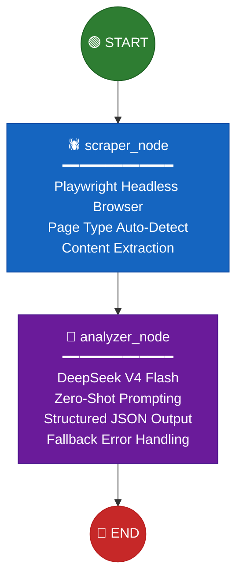
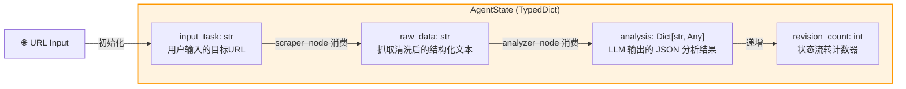
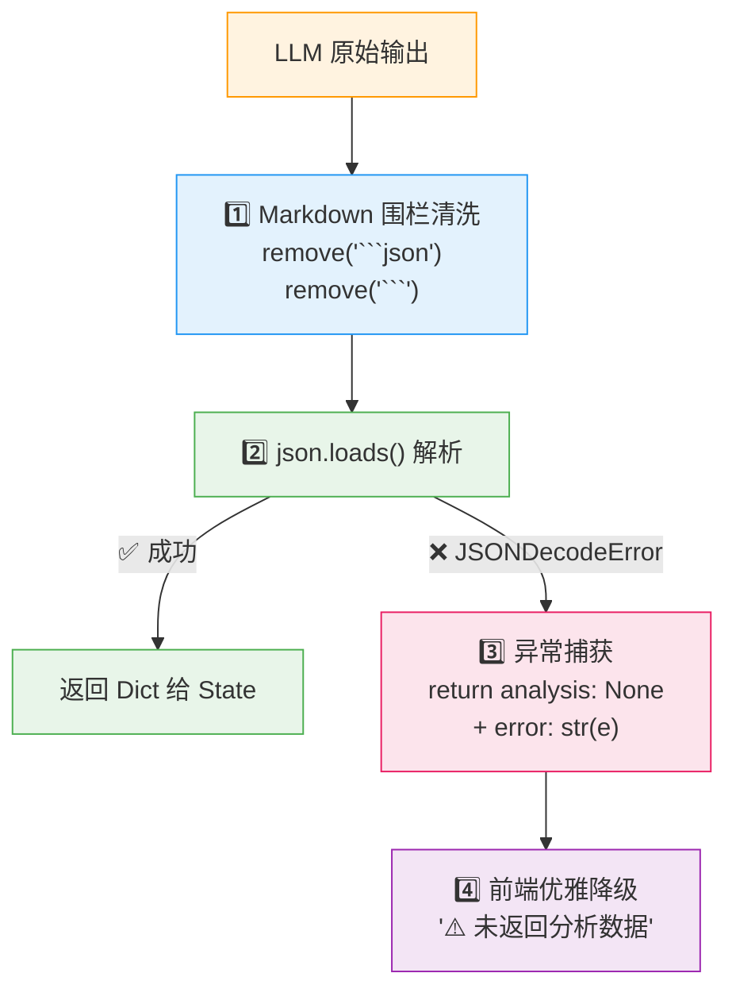

# 🌍 Global Sense Agent

<div align="center">

[](https://www.python.org/)
[](https://langchain-ai.github.io/langgraph/)
[](https://www.langchain.com/)
[](https://api.deepseek.com/)
[](https://playwright.dev/)
[](https://fastapi.tiangolo.com/)
[](https://streamlit.io/)
[](LICENSE)

</div>

---

## 1. 项目定位与业务场景

### 🎯 一句话定义

**Global Sense Agent** 是一个基于 **LangGraph 有状态图拓扑** 与 **DeepSeek 大模型** 构建的 **自主式电商竞品情报智能体（Autonomous E-Commerce Competitive Intelligence Agent）**。它能够自主完成 **网页抓取 → 结构化数据清洗 → LLM 语义分析 → 结构化 JSON 输出** 的完整闭环，实现了从非结构化 Web 数据到可决策商业洞察的端到端自动化。

### 📊 业务场景

| 场景 | 描述 |
|---|---|
| **竞品价格监控** | 自动抓取竞品列表页，提取价格区间，生成价格策略分析 |
| **商品详情拆解** | 对单品详情页进行深度语义解析，输出用户痛点、产品优势与改进机会 |
| **评论风险审计** | 分析评论数据的真实性风险，识别疑似虚假评论模式 |
| **多端服务化部署** | 同时支持 Streamlit 交互式 UI、FastAPI RESTful 接口、纯 HTML 静态前端三种消费模式 |

### 🧠 设计哲学

本项目严格遵循 **Agent = 状态拓扑 + 工具调用 + 推理引擎** 的架构范式：

- **状态拓扑 (State Topology)**：基于 `TypedDict` 定义有向无环图 (DAG)，确保状态在各节点间类型安全地流转
- **工具调用 (Tool Use)**：Playwright 头浏览器作为感知层工具，实现对任意 Web 页面的实时信息采集
- **推理引擎 (Reasoning Engine)**：DeepSeek V4 Flash 大模型在 `temperature=0.1` 下执行零样本提示 (Zero-Shot Prompting) 的结构化推理

---

## 2. 智能体拓扑架构

### 2.1 LangGraph 状态图 (StateGraph) 拓扑



### 2.2 状态传递机制 (State Schema)



**状态流转机制的核心设计原则**：

1. **不可变性保证**：每个节点返回 `dict` 类型的增量更新，LangGraph 内部执行 `state | update` 合并，保证并发安全
2. **类型安全**：`AgentState(TypedDict, total=False)` 使用 Python 类型系统约束字段，IDE 可提供完整的智能提示
3. **可观测性**：`revision_count` 作为状态计数器，为后续引入反思循环 (Reflexion Loop) 提供基础——当 `revision_count < MAX_RETRIES` 时可触发自校正重试

### 2.3 系统架构全景图

```mermaid
graph TB
    subgraph Frontend["🎨 前端消费层"]
        S1["Streamlit UI<br/>(app.py)"]
        S2["FastAPI + Vanilla HTML<br/>(server.py + index.html)"]
    end

    subgraph Orchestrator["⚙️ 编排层"]
        MAIN["main.py<br/>━━━━━━━━━━<br/>build_graph()<br/>run_logic()<br/>save_result()"]
    end

    subgraph AgentGraph["🔗 Agent 拓扑层 (LangGraph)"]
        NODES["nodes.py<br/>━━━━━━━━━━<br/>scraper_node<br/>analyzer_node"]
    end

    subgraph Tools["🔧 工具层"]
        SCRAPER["scraper.py<br/>Playwright Headless"]
        LLM["DeepSeek V4 Flash<br/>ChatOpenAI SDK"]
    end

    subgraph Persistence["💾 持久化层"]
        JSON["data/result_{timestamp}.json"]
    end

    S1 -->|"subprocess IPC"| MAIN
    S2 -->|"async direct call"| MAIN
    MAIN -->|"app.ainvoke()"| NODES
    NODES -->|"await"| SCRAPER
    NODES -->|"llm.invoke()"| LLM
    MAIN --> JSON
```



---

## 3. 核心技术栈与工程实现

### 3.1 技术栈矩阵

| 层级 | 技术选型 | 版本要求 | 选型理由 |
|---|---|---|---|
| **LLM 推理** | DeepSeek V4 Flash | — | 高性价比、支持 OpenAI 兼容协议 |
| **LLM 客户端** | LangChain `ChatOpenAI` | ≥ 0.3.0 | 统一 API 抽象，无缝切换模型供应商 |
| **Agent 框架** | LangGraph `StateGraph` | ≥ 0.2.0 | 原生支持有状态 DAG、节点级可观测性、异步执行 |
| **数据采集** | Playwright (Chromium) | ≥ 1.40 | 完整浏览器环境，支持 SPA/动态渲染页面 |
| **API 服务** | FastAPI + Uvicorn | ≥ 0.100 | 高性能异步 ASGI，原生 `async/await` 兼容 |
| **交互式 UI** | Streamlit | ≥ 1.28 | 零前端代码的数据应用快速原型 |
| **环境管理** | python-dotenv | ≥ 1.0 | 敏感凭据与代码分离 |

### 3.2 核心模块深度拆解

#### 3.2.1 网页抓取节点 — `scraper.py`

```python
# 核心设计：页面类型自适应 (Page-Type Auto-Detection)
products = await page.locator(".product_pod").all()

if len(products) > 0:
    # 列表页模式：批量提取商品名 + 价格
    for p_item in products[:10]:
        title = await p_item.locator("h3 a").get_attribute("title")
        price = await p_item.locator(".price_color").inner_text()
else:
    # 详情页模式：提取单品全量信息
    title = await page.locator("h1").inner_text()
    price = await page.locator(".price_color").inner_text()
    # 可选字段容错处理
    desc_locator = page.locator("#product_description ~ p")
    if await desc_locator.count() > 0:
        description = await desc_locator.inner_text()
```

**工程亮点**：

- **自适应页面类型推断**：通过 CSS 选择器 `.product_pod` 的有无自动判别列表页/详情页，无需人工配置
- **浏览器指纹伪装**：自定义 `user_agent` 与 `viewport`，降低反爬拦截概率
- **懒加载容错**：`wait_for_timeout(1000)` 为动态渲染内容提供缓冲，再通过 `wait_for_load_state("domcontentloaded")` 确保 DOM 就绪
- **可选字段安全提取**：`desc_locator.count() > 0` 守卫式检查，避免 `inner_text()` 抛出 `ElementNotFound` 异常
- **资源泄漏防护**：所有代码路径（正常/异常）均显式调用 `await browser.close()`

#### 3.2.2 LLM 推理节点 — `nodes.py`

```python
# 严格温度控制，保证输出可复现
llm = ChatOpenAI(
    model='deepseek-v4-flash',
    openai_api_key=os.getenv("DEEPSEEK_API_KEY"),
    openai_api_base=os.getenv("DEEPSEEK_API_BASE"),
    max_tokens=2048,
    temperature=0.1          # ← 接近贪婪解码，抑制随机采样噪声
)
```

**零样本提示 (Zero-Shot Prompt) 模板设计**：

```text
你是一位电商高级运营专家。请根据提供的产品数据，输出一份中文商业分析。

必须严格输出 JSON（不能有 ``` 或解释）：

{
    "product_name": "",
    "price_range_analysis": "",
    "pain_points": [],
    "opportunities": []
}
```

**提示工程分析**：

| 设计要素 | 具体实现 | 效果 |
|---|---|---|
| **角色锚定 (Persona Anchoring)** | "电商高级运营专家" | 激活模型在电商领域的专家知识分布 |
| **输出格式约束** | "必须严格输出 JSON（不能有 ``` 或解释）" | 抑制模型产生思维链 (Chain-of-Thought) 前置文本 |
| **结构化骨架 (JSON Skeleton)** | 预定义 Key 名称与空值类型 `""` / `[]` | 诱导模型在预定义 Schema 内填充，而非自由生成 |
| **上下文窗口截断** | `raw_text[:8000]` | 防止输入超过模型上下文窗口限制 (Context Window Overflow) |

#### 3.2.3 LangGraph 编排层 — `main.py`

```python
def build_graph():
    workflow = StateGraph(AgentState)
    workflow.add_node("scraper", scraper_node)
    workflow.add_node("analyzer", analyze_data_node)
    workflow.set_entry_point("scraper")
    workflow.add_edge("scraper", "analyzer")
    workflow.add_edge("analyzer", END)
    return workflow.compile()
```

**拓扑决策分析**：

- **线性管道 (Linear Pipeline)** 而非复杂 DAG：当前业务场景为串行依赖（分析依赖抓取结果），线性拓扑降低了状态管理复杂度
- **`total=False` TypedDict**：允许状态字段在中间节点部分填充，避免全字段初始化开销
- **`app.ainvoke()`**：异步图执行，在 I/O 密集型抓取阶段释放事件循环

#### 3.2.4 多前端消费层

| 入口 | 文件 | 通信机制 | 适用场景 |
|---|---|---|---|
| **Streamlit** | `app.py` | `subprocess.Popen` 进程隔离 + stdout IPC | 本地快速调试与演示 |
| **FastAPI** | `server.py` | RESTful `GET /analyze?url=...` | 微服务化部署、第三方集成 |
| **Vanilla HTML** | `index.html` | `fetch()` + 动态卡片渲染 | 零依赖前端、内网穿透演示 |

**Streamlit 进程隔离设计**（关键工程决策）：

```python
# 使用 subprocess 而非直接 import，避免 asyncio 事件循环冲突
process = subprocess.Popen(
    [sys.executable, "src/main.py", url_input],
    stdout=subprocess.PIPE,
    stderr=subprocess.PIPE,
    text=True, encoding='utf-8'
)
```

Streamlit 自身运行在 Tornado 事件循环中，直接调用 `asyncio.run()` 会在 Windows 上触发 `RuntimeError: This event loop is already running`。通过进程隔离，`main.py` 在独立的 Python 解释器中获得干净的事件循环。

---

## 4. 算法鲁棒性与工程兜底机制

### 4.1 结构化输出保障体系

LLM 的输出本质上是**非确定性的概率采样**，并不能 100% 保证 JSON 格式正确。本项目构建了 **四级兜底机制**：



对应的核心代码路径：

```python
try:
    response = llm.invoke([HumanMessage(content=prompt)])
    # 第一级：Markdown 围栏清洗
    clean_content = response.content.replace("```json", "").replace("```", "").strip()
    # 第二级：JSON 解析
    parsed = json.loads(clean_content)
    return {"analysis": parsed, "revision_count": state.get("revision_count", 0) + 1}
except Exception as e:
    # 第三级：全量异常捕获，防止节点崩溃导致整个图执行中断
    return {"analysis": None, "error": str(e), "revision_count": state.get("revision_count", 0) + 1}
```

### 4.2 鲁棒性设计矩阵

| 风险场景 | 工程对策 | 代码位置 |
|---|---|---|
| **LLM 输出非 JSON** | Markdown 围栏剥离 + `json.loads()` 强校验 | `nodes.py:65-68` |
| **JSON 解析失败** | `try/except` 全量兜底，返回 `None` + `error` 字段 | `nodes.py:77-83` |
| **网页抓取超时** | `page.goto(url, timeout=30000)` 30 秒超时 | `scraper.py:18` |
| **目标元素缺失** | `count() > 0` 前置守卫，可选字段空字符串默认值 | `scraper.py:61-62` |
| **抓取内容过短/空白** | 内容长度 < 200 字符判定为抓取失败 | `nodes.py:30-31` |
| **上下文窗口溢出** | `raw_text[:8000]` 硬截断，配合 `max_tokens=2048` | `nodes.py:56` |
| **LLM 随机性** | `temperature=0.1` 近贪婪解码，最大化输出确定性 | `nodes.py:18` |
| **Windows 事件循环冲突** | `WindowsProactorEventLoopPolicy` 全局覆盖 | `main.py:12-13` |
| **Streamlit 事件循环冲突** | 子进程隔离，独立 Python 解释器 | `app.py:18-23` |
| **前端 JS 解析失败** | `if (!analysis)` 守卫 + 友好错误提示卡片 | `index.html:108-111` |

### 4.3 前端优雅降级

```javascript
// 当 analysis 字段为 null/undefined 时，不崩溃，展示友好提示
if (!analysis) {
    resBox.innerHTML = `<div class="card">⚠️ 未返回 analysis 数据</div>`;
    return;
}

// 可选字段使用可选链操作符 + 默认值
<p><b>风险等级：</b>${analysis.fake_review_warning?.risk_level || "-"}</p>
```

### 4.4 可观测性设计

```python
# 每个节点进入时打印状态标识
print("\n--- [节点] 启动抓取流程 ---")
print("--- [节点] 正在生成深度洞察报告 ---")

# LLM 原始输出完整打印（调试模式）
print("LLM原始输出:", response.content)

# 错误时完整堆栈追踪
import traceback
error_detail = traceback.format_exc()
print(f"❌ 后端报错:\n{error_detail}")

# 结果持久化为时间戳命名的 JSON
# data/result_20260428_222738.json
```

---

## 5. 项目目录与启动指南

### 5.1 项目目录树

```
Global_Sense_Agent/
├── .env.example                  # 环境变量模板（需自行创建）
├── .gitignore                    # Git 忽略规则
├── README.md                     # 本文件
├── requirements.txt              # Python 依赖清单
├── data/                         # 运行结果持久化目录（gitignore）
│   └── result_YYYYMMDD_HHMMSS.json
├── notebooks/                    # Jupyter 实验笔记本（预留）
└── src/                          # 核心源码
    ├── __init__.py               # 包声明
    ├── state.py                  # AgentState TypedDict 状态定义
    ├── scraper.py                # Playwright 网页抓取工具
    ├── nodes.py                  # LangGraph 节点实现 (scraper + analyzer)
    ├── main.py                   # 图编排入口 + CLI
    ├── server.py                 # FastAPI REST 服务
    ├── app.py                    # Streamlit 交互式 UI
    └── index.html                # 纯 HTML 静态前端
```

### 5.2 环境配置

#### Step 1: 克隆与虚拟环境

```bash
git clone <your-repo-url>
cd Global_Sense_Agent

# 使用 venv
python -m venv venv

# Windows 激活
venv\Scripts\activate

# macOS / Linux 激活
source venv/bin/activate
```

#### Step 2: 安装依赖

```bash
pip install -r requirements.txt

# Playwright 浏览器驱动（首次使用必须安装）
playwright install chromium
```

**`requirements.txt`** 内容：

```
langgraph>=0.2.0
langchain-openai>=0.3.0
langchain-core>=0.3.0
playwright>=1.40.0
streamlit>=1.28.0
fastapi>=0.100.0
uvicorn>=0.30.0
python-dotenv>=1.0.0
```

#### Step 3: 配置环境变量

在项目根目录创建 `.env` 文件：

```bash
DEEPSEEK_API_KEY=sk-your-deepseek-api-key
DEEPSEEK_API_BASE=https://api.deepseek.com
```

### 5.3 启动方式

#### 方式一：命令行直接运行（调试用）

```bash
cd src
python main.py "http://books.toscrape.com"
```

输出将打印到 stdout，同时持久化到 `data/result_{timestamp}.json`。

#### 方式二：Streamlit 交互式 UI

```bash
cd src
streamlit run app.py
```

浏览器访问 `http://localhost:8501`，在输入框中粘贴目标 URL，点击"开始分析"。

#### 方式三：FastAPI REST 服务 + Web 前端

```bash
cd src
python server.py
```

- Web 前端：`http://127.0.0.1:8080/`
- API 端点：`GET http://127.0.0.1:8080/analyze?url=<encoded_url>`

#### 方式四：仅 API 服务（微服务化部署）

```bash
uvicorn src.server:app --host 0.0.0.0 --port 8080
```

### 5.4 API 接口规范

**请求**：

```http
GET /analyze?url=http://books.toscrape.com
```

**成功响应 (200)**：

```json
{
  "status": "success",
  "data": {
    "input_task": "http://books.toscrape.com",
    "raw_data": "商品: A Light in the ... | 价格: £51.77\n...",
    "analysis": {
      "product_name": "A Light in the Attic",
      "price_range_analysis": "该商品定价 £51.77...",
      "pain_points": ["价格偏高", "描述信息不足"],
      "opportunities": ["优化商品描述SEO", "增加用户评价引导"]
    },
    "revision_count": 1
  }
}
```

**错误响应 (200)**：

```json
{
  "status": "error",
  "message": "LLM 分析阶段出错: Expecting value: line 1 column 1 (char 0)",
  "detail": "Traceback (most recent call last):\n..."
}
```

---

## 6. 扩展路线图 (Roadmap)

- [ ] **反思循环 (Reflexion Loop)**：当 `revision_count < 3` 且 JSON 解析失败时，将错误信息反馈给 LLM 进行自校正重试
- [ ] **多 Agent 并行化**：引入 `Send()` API 实现列表页多商品并行分析，而非当前串行处理
- [ ] **通用化抓取适配器**：抽象 `BaseScraper` 接口，支持 Amazon / Shopify / 淘宝 等多平台适配
- [ ] **向量化记忆 (Vector Memory)**：将历史分析结果 Embedding 化存储，复用相似竞品的历史推理
- [ ] **结构化输出强制 (Structured Output)**：迁移至 DeepSeek 的 JSON Mode 或 LangChain `with_structured_output()`，从概率层面约束 Token 生成
- [ ] **流式响应 (SSE Streaming)**：将 `analyzer_node` 的输出改为 Streaming，前端实时展示分析过程
- [ ] **Neo4j 知识图谱集成**：将商品-价格-评论实体化为图结构，支持二阶关系推理（如：某供应商涨价 → 下游所有竞品受影响）
- [ ] **自动化测试**：引入 `pytest` + `pytest-asyncio`，覆盖节点级与图级单元测试

---

## 7. 架构决策记录 (ADR)

| 决策 | 选择 | 替代方案 | 选择理由 |
|---|---|---|---|
| Agent 框架 | LangGraph | AutoGen, CrewAI | 最小抽象层，显式状态图，无黑盒 |
| LLM 协议 | OpenAI Compatible | Native DeepSeek SDK | 供应商无关，一行改 base_url 即可切换 |
| 抓取引擎 | Playwright | httpx + BeautifulSoup | 支持 JS 渲染页面，为真实电商站点做准备 |
| 状态管理 | TypedDict | Pydantic BaseModel | LangGraph 原生支持，零额外依赖 |
| 进程模型 | subprocess (Streamlit) | asyncio.create_task | Windows 兼容性优先 |

---

<div align="center">

**Built with ❤️ using LangGraph + DeepSeek**

*Global Sense Agent — 让每一个商品页面都成为可决策的情报*

</div>
