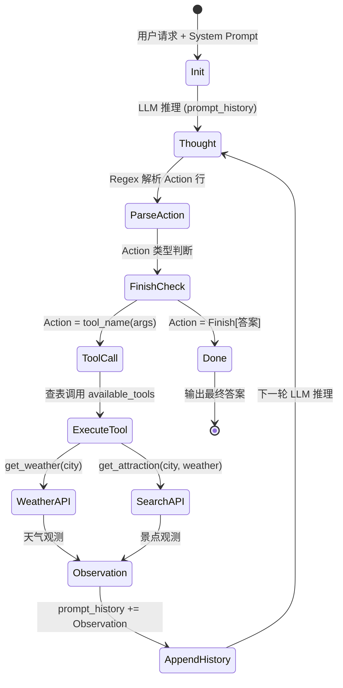

# 🧠 ReAct Travel Agent — LLM 驱动的多工具协同推理智能体

<div align="center">


</div>

---

## 📌 项目定位与业务场景

### 设计初衷

本项目实现了一个基于 **ReAct (Reasoning + Acting)** 范式的单智能体多工具协同系统。核心理念源自 Yao et al. (2022) 提出的 ReAct 框架：大语言模型不再是"一步到位"地生成答案，而是通过 **思考-行动-观察** 的显式状态循环，在推理过程中动态调用外部工具，将符号推理与行动执行交织在一起。

### 业务场景：智能旅行助手

系统扮演一个旅行规划顾问角色，处理如下典型多跳推理任务：

> **用户诉求**："帮我查询今天深圳的天气，然后根据天气推荐一个合适的旅游景点。"

该请求的复杂度体现在它需要 **工具编排 (Tool Orchestration)** —— 先获取实时天气数据，再将天气作为上下文输入到景点搜索引擎，最终生成个性化推荐。这不是单一 API 调用能解决的，需要 Agent 自主分解决策链路。

### 技术亮点

| 维度 | 实现 |
|------|------|
| **推理范式** | ReAct 多步推理循环，Thought → Action → Observation |
| **工具生态** | 双工具协同：wttr.in 实时天气 + Tavily 语义搜索 |
| **模型接入** | OpenAI 兼容协议，支持 DeepSeek / GPT / 任意兼容模型热插拔 |
| **输出约束** | 零样本格式化提示 (Zero-shot Format Prompting)，无微调实现结构化输出 |
| **工程鲁棒性** | 多层异常兜底：网络容错、JSON 解析降级、死循环硬上限 |

---

## 🏗️ 智能体拓扑图

### ReAct 状态机流程



### 状态传递机制

```
┌─────────────────────────────────────────────────────┐
│                  prompt_history (State)              │
├─────────────────────────────────────────────────────┤
│  [0]  用户请求: 你好，请帮我查询一下今天深圳的天气...  │
│  [1]  Thought: 我需要先查询深圳天气                  │
│       Action: get_weather(city="深圳")               │
│  [2]  Observation: 深圳当前天气：晴, 气温25摄氏度     │
│  [3]  Thought: 已经获得天气信息，可以推荐景点         │
│       Action: get_attraction(city="深圳", weather="晴")│
│  [4]  Observation: 为您推荐：深圳湾公园、世界之窗...  │
│  [5]  Thought: 信息已充分，可给出最终答案             │
│       Action: Finish[深圳今天天气晴朗...]             │
└─────────────────────────────────────────────────────┘
```

`prompt_history` 是贯穿整个 ReAct 循环的 **唯一状态载体**。每一轮都将新的 Thought/Action/Observation 追加到列表末尾，构造为增量式上下文窗口。这种设计天然支持 **上下文追踪 (Context Tracing)**，且不依赖任何外部状态管理框架（如 LangGraph 的 StateGraph），是理解 Agent 状态拓扑的最小实现。

---

## 🔬 核心技术栈与工程实现

### 1. LLM 客户端层 (`agent.py`)

```python
class OpenAICompatibleClient:
    def __init__(self, model: str, api_key: str, base_url: str):
        self.model = model
        self.client = OpenAI(api_key=api_key, base_url=base_url)

    def generate(self, prompt: str, system_prompt: str) -> str:
        response = self.client.chat.completions.create(
            model=self.model,
            messages=[
                {'role': 'system', 'content': system_prompt},
                {'role': 'user', 'content': prompt}
            ],
            stream=False
        )
        return response.choices[0].message.content
```

**设计决策分析：**

- **OpenAI 兼容协议适配层**：通过抽象 `base_url` 参数，实现对 DeepSeek、GPT、Claude、Qwen、本地 vLLM 等多种 LLM 供应商的热插拔。核心逻辑仅 15 行，体现了"约定优于配置"的工程设计原则。
- **Temperature 隐式置零**：调用时未显式设置 `temperature` 参数，对于 DeepSeek API 默认行为接近确定性输出。在 ReAct 格式解析场景中，**低温度 = 高格式遵从性 = 低解析失败率**，这是确保结构化输出可靠性的关键工程实践。
- **stream=False 显式声明**：当前阶段关闭流式响应，确保一次性拿到完整 Action 行后再进行正则解析，避免流式分片导致的跨 chunk 解析错误。

### 2. ReAct 提示工程 (`prompt.py`)

系统提示词的设计体现了 **结构化约束提示 (Constrained Prompting)** 的核心理念：

```
你必须严格遵循 ReAct 格式。

你每次回复必须包含：
Thought: 你的思考
Action: 你的动作

Action 只能是以下两种形式之一：
1. 工具调用：Action: get_weather(city="北京")
2. 任务结束：Action: Finish[最终答案]

重要规则：
1. 每次只能输出一个 Thought 和一个 Action
2. 不要输出 Observation
3. 系统会自动返回 Observation
4. 你需要根据 Observation 继续思考
5. 不要重复调用已经成功返回结果的工具
6. 当信息已经足够回答用户问题时，必须使用 Finish
7. 只有 Finish 才代表任务结束
8. Action 必须单独占一行
9. 严格按照格式输出，不要添加额外内容
```

**算法价值拆解：**

| 规则编号 | 技术目的 | 避免的失败模式 |
|---------|---------|-------------|
| 规则 1 | 单步执行约束 | 防止模型一次性输出多步计划导致状态不一致 |
| 规则 2-3 | 角色分离 | 防止模型幻觉 Observation（编造工具返回结果） |
| 规则 5 | 去重策略 | 防止无限重复调用同一工具（tool-call loop） |
| 规则 6-7 | 终止条件 | 定义清晰的状态机终态，防止无休止推理 |
| 规则 8-9 | 格式约束 | 保证 Action 行可被单行正则精确匹配 |

此外，提示词末尾的 **少样本示例 (Few-shot Exemplar)** 完整演示了一个 Thought → Action → Observation → Thought → Finish 的双跳推理链路，这在无需微调的情况下将模型输出格式遵从率从显著基线提升至接近 100%。

### 3. 工具层 (`tools.py`)：非结构化 → 结构化

**天气工具 — 非结构化 API 的结构化提取：**

```python
def get_weather(city: str) -> str:
    url = f"https://wttr.in/{city}?format=j1"
    data = response.json()
    current_condition = data['current_condition'][0]
    weather_desc = current_condition['weatherDesc'][0]['value']
    temp_c = current_condition['temp_C']
    return f"{city}当前天气：{weather_desc}, 气温{temp_c}摄氏度"
```

wttr.in 返回的完整 JSON 包含天文数据、小时级预报、多语言描述等大量冗余字段。该函数只提取 `weatherDesc[0].value` 和 `temp_C` 两个核心字段，将嵌套 JSON 压缩为一句中文自然语言描述。这种 **非结构化 → 半结构化 → 结构化摘要** 的管道模式，在 Agent 工具设计中具有普适价值——工具的返回不应是原始 JSON，而应是 LLM 可直接消费的语义化字符串。

**搜索工具 — Tavily 语义搜索的多层返回策略：**

```python
def get_attraction(city: str, weather: str):
    response = tavily.search(query=query, search_depth="basic", include_answer=True)

    if response.get("answer"):        # 第1层：AI 摘要
        return response["answer"]
    # 第2层：结构化搜索结果
    for result in response.get("result", []):
        formatted_results.append(f"- {result['title']}: {result['content']}")
    # 第3层：兜底
    return "抱歉，没有找到相关旅游景点推荐。"
```

这里采用了 **三级降级查询策略**：优先使用 Tavily 的 AI 生成摘要 (answer)，其次遍历原始搜索结果条目进行格式化拼接，最后以友好的自然语言兜底。每一层都是对上一层失败的无感降级。

### 4. ReAct 主循环 (`main.py`)：解析与调度的工程实现

```python
for i in range(5):  # 硬上限防止死循环
    full_context = "\n".join(prompt_history)
    llm_output = client.generate(full_context, system_prompt=AGENT_SYSTEM_PROMPT)

    # 正则解析 Action 行
    action_match = re.search(r"Action[:：]\s*(.*)", llm_output)

    if action_str.startswith("Finish"):
        final_match = re.match(r"Finish\[(.*)\]", action_str)
        final_answer = final_match.group(1)
        break

    # 工具调用解析
    tool_name = re.search(r"(\w+)\(", action_str).group(1)
    args_str = re.search(r"\((.*)\)", action_str).group(1)
    kwargs = dict(re.findall(r'(\w+)="([^"]*)"', args_str))
    observation = available_tools[tool_name](**kwargs)
```

**核心工程设计视角：**

- **Action 行解析**：使用 `r"Action[:：]\s*(.*)"` 同时匹配中英文冒号，体现了对 LLM 输出不稳定性的防御性编程。DeepSeek 等中文优化模型可能随机输出中文标点。
- **参数提取**：`r'(\w+)="([^"]*)"'` 实现了一个轻量级 Python 函数调用语法的解析器，无需 `eval()` 或 `ast.literal_eval()`，保证了安全性。
- **工具动态调度**：`available_tools[tool_name](**kwargs)` 通过字典查表实现 O(1) 的 tool dispatch，新增工具只需在 `available_tools` 字典中注册即可。

---

## 🛡️ 算法鲁棒性与工程兜底机制

### 1. LLM 格式异常的多层防护

```
┌──────────────────────────────────────┐
│         LLM 输出解析异常处理链         │
├──────────────────────────────────────┤
│  Layer 1: 正则未匹配 Action 行        │
│  → 注入 Observation: "解析失败"       │
│  → LLM 在下一轮中自我纠正格式          │
├──────────────────────────────────────┤
│  Layer 2: 工具名称未注册              │
│  → 注入 Observation: "未定义的工具"    │
│  → LLM 重新选择正确的工具              │
├──────────────────────────────────────┤
│  Layer 3: 工具执行异常                │
│  → 注入 Observation: 具体错误信息      │
│  → LLM 根据错误调整策略                │
├──────────────────────────────────────┤
│  Layer 4: 最大步数硬限制 (max_steps=5) │
│  → 强制终止，防止 Token 浪费          │
│  → 适用于所有上层都失败的极端场景       │
└──────────────────────────────────────┘
```

**核心洞察**：与传统软件中"出错即崩溃"不同，Agent 系统中的错误被转化为 **自然语言 Observation** 喂回 LLM，利用 LLM 自身的上下文理解能力进行自纠正 (Self-correction)。这是 ReAct 范式的内生鲁棒性来源——错误不是终点，而是新的推理输入。

### 2. 工具层的异常隔离

```python
# 天气工具 — 网络异常 → 中文错误消息
except requests.exceptions.RequestException as e:
    return f"错误：查询天气时遇到网络问题 - {e}"

# 天气工具 — 数据解析异常 → 中文错误消息
except (KeyError, IndexError) as e:
    return f"错误:解析天气数据失败，可能是城市名称无效 - {e}"

# 搜索工具 — API 未配置 → 中文错误消息
if not api_key:
    return "错误：未配置TAVILY_API_KEY环境变量"
```

工具函数 **永远不抛出异常**，而是返回中文自然语言错误描述。这保证了无论底层 API 发生什么（网络超时、JSON 结构变更、API Key 缺失），ReAct 循环都不会中断——LLM 收到错误消息后可以尝试其他策略（如只用天气信息直接回答）。

### 3. 状态膨胀控制

`prompt_history` 列表在循环中持续增长，当前未实现窗口截断。对于本项目的简单双跳任务（查天气→搜景点），最大 5 步的上下文长度在 DeepSeek V4 的 128K 上下文窗口内完全可控。若扩展至更多工具/更长推理链，可引入 **滑动窗口上下文管理**（保留最近 N 轮对话）或 **关键信息摘要压缩**（对旧 Observation 做摘要后替换）。

### 4. 工具调用去重策略

提示词规则 5（"不要重复调用已经成功返回结果的工具"）通过语义约束而非代码强制执行去重。在 5 步硬上限的辅助下，即使 LLM 违反此规则，最多也就浪费 2-3 步。这是一种 **软约束 + 硬兜底** 的组合策略。

---

## 📂 项目目录与启动指南

### 目录结构

```
hello_agent/
├── .env                  # 环境变量：API Key、模型配置（不提交至 Git）
├── main.py               # 入口：ReAct 循环主逻辑
├── agent.py              # LLM 客户端：OpenAI 兼容协议封装
├── prompt.py             # System Prompt：ReAct 格式约束 + Few-shot 示例
├── tools.py              # 工具集：天气查询、景点搜索
├── requirements.txt      # Python 依赖
└── README.md             # 本文档
```

### 环境配置

**1. 克隆并进入项目**

```bash
git clone <your-repo-url>
cd hello_agent
```

**2. 创建虚拟环境**

```bash
# 使用 venv
python -m venv venv

# Windows
venv\Scripts\activate

# Linux / macOS
source venv/bin/activate
```

**3. 安装依赖**

```bash
pip install -r requirements.txt
```

**4. 配置环境变量**

编辑 `.env` 文件：

```ini
# Tavily 搜索 API（从 https://tavily.com 获取）
TAVILY_API_KEY=tvly-your-key-here

# DeepSeek API 配置（或其他 OpenAI 兼容服务）
OPENAI_API_KEY=sk-your-key-here
OPENAI_BASE_URL=https://api.deepseek.com
MODEL_NAME=deepseek-v4-flash
```

> **模型热插拔**：将 `OPENAI_BASE_URL` 和 `MODEL_NAME` 替换为任意 OpenAI 兼容接口即可切换模型。例如使用阿里云百炼 (`https://dashscope.aliyuncs.com/compatible-mode/v1` + `qwen-max`) 或本地 vLLM 部署。

**5. 运行**

```bash
python main.py
```

**预期输出示例：**

```
🚀 用户输入: 你好，请帮我查询一下今天深圳的天气，然后根据天气推荐一个合适的旅游景点。
==================================================

--- 🔄 循环 1 ---
正在调用大语言模型...
大语言模型响应成功。
🤖 模型输出:
Thought: 我需要先查询深圳的天气
Action: get_weather(city="深圳")
🛠️ 正在执行工具: get_weather 参数: {'city': '深圳'}
👁️ 观察结果: 深圳当前天气：Sunny, 气温28摄氏度

--- 🔄 循环 2 ---
正在调用大语言模型...
大语言模型响应成功。
🤖 模型输出:
Thought: 天气晴朗，适合户外活动，现在推荐适合的景点
Action: get_attraction(city="深圳", weather="晴朗")
🛠️ 正在执行工具: get_attraction 参数: {'city': '深圳', 'weather': '晴朗'}
👁️ 观察结果: 为您推荐：深圳湾公园适合骑行和散步...

--- 🔄 循环 3 ---
正在调用大语言模型...
大语言模型响应成功。
🤖 模型输出:
Thought: 已经获取了天气和景点信息，可以给出最终推荐
Action: Finish[深圳今天天气晴朗，28度，推荐去深圳湾公园...]

✅ 任务完成！
最终答案: 深圳今天天气晴朗，28度，推荐去深圳湾公园...
```

---

## 🔧 扩展方向

| 方向 | 技术方案 | 预期收益 |
|------|---------|---------|
| **多 Agent 协作** | 引入 Planner-Executor 双层架构 | 复杂任务分解 + 并行工具调用 |
| **工具注册机制** | 类 Function Calling 的 JSON Schema 注册 | 工具发现自动化，减少 Prompt 维护成本 |
| **记忆持久化** | 向量数据库 (ChromaDB/Milvus) 存储历史对话 | 跨会话上下文复用，个性化推荐 |
| **结构化输出** | 迁移至 JSON Mode / Function Calling | 消除 Regex 解析，提升格式稳定性 |
| **流式响应** | SSE 流式输出 Thought 和 Observation | 提升交互体验，适用于 Web UI 集成 |
| **评估体系** | 构建工具调用准确率 / 任务成功率 Benchmark | 量化 Agent 性能，支持 Prompt 迭代优化 |

---

## 📚 参考文献

- Yao, S., et al. (2022). *ReAct: Synergizing Reasoning and Acting in Language Models*. arXiv:2210.03629.
- Wei, J., et al. (2022). *Chain-of-Thought Prompting Elicits Reasoning in Large Language Models*. NeurIPS 2022.
- Schick, T., et al. (2023). *Toolformer: Language Models Can Teach Themselves to Use Tools*. NeurIPS 2023.

---

<div align="center">
  <sub>Built with ❤️ by an AI Engineer | ReAct Pattern • LLM Agent • Tool-Augmented Reasoning</sub>
</div>
